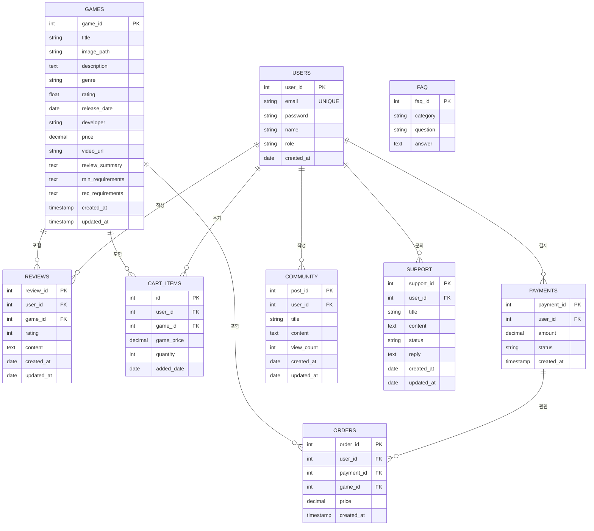

### Updated Database Schema



------

### USERS Table

```sql
CREATE TABLE Users (
    user_id NUMBER PRIMARY KEY, -- 고유 ID
    email VARCHAR2(100) UNIQUE NOT NULL, -- 유니크한 이메일
    password VARCHAR2(100) NOT NULL, -- 비밀번호 (해시값 저장)
    name VARCHAR2(50),
    role VARCHAR2(10) DEFAULT 'USER', -- 'USER' 또는 'ADMIN'
    created_at DATE DEFAULT SYSDATE
);

CREATE SEQUENCE user_seq
START WITH 1
INCREMENT BY 1
NOCACHE;
```

------

### GAMES Table

```sql
CREATE TABLE Games (
    game_id NUMBER PRIMARY KEY, -- 고유 ID
    title VARCHAR2(255) NOT NULL, -- 게임 제목
    image_path VARCHAR2(500), -- 이미지 경로
    description CLOB, -- 게임 설명
    genre VARCHAR2(100), -- 장르
    rating NUMBER(3, 1) DEFAULT 0.0 CHECK (rating BETWEEN 0.0 AND 10.0), -- 평점
    release_date DATE NOT NULL, -- 출시일
    developer VARCHAR2(255) NOT NULL, -- 개발사
    price NUMBER(10, 2) NOT NULL CHECK (price >= 0), -- 가격
    video_url VARCHAR2(500), -- 동영상 URL
    review_summary CLOB, -- 리뷰 요약
    min_requirements CLOB, -- 최소 요구사항
    rec_requirements CLOB, -- 권장 요구사항
    created_at TIMESTAMP DEFAULT CURRENT_TIMESTAMP, -- 생성 시간
    updated_at TIMESTAMP -- 업데이트 시간
);

CREATE SEQUENCE games_seq
START WITH 1
INCREMENT BY 1
NOCACHE;
```

------

### REVIEWS Table

```sql
CREATE TABLE Reviews (
    review_id NUMBER PRIMARY KEY, -- 리뷰 ID
    user_id NUMBER NOT NULL, -- 사용자 ID (외래 키)
    game_id NUMBER NOT NULL, -- 게임 ID (외래 키)
    rating NUMBER CHECK (rating BETWEEN 1 AND 10) NOT NULL, -- 평점
    content CLOB NOT NULL, -- 리뷰 내용
    created_at DATE DEFAULT SYSDATE NOT NULL, -- 작성 날짜
    updated_at DATE, -- 수정 날짜

    CONSTRAINT fk_reviews_user FOREIGN KEY (user_id) REFERENCES Users(user_id),
    CONSTRAINT fk_reviews_game FOREIGN KEY (game_id) REFERENCES Games(game_id)
);

CREATE SEQUENCE reviews_seq
START WITH 1
INCREMENT BY 1
NOCACHE;
```

------

### CART_ITEMS Table

```sql
CREATE TABLE Cart_Items (
    id NUMBER PRIMARY KEY, -- 고유 ID
    user_id NUMBER NOT NULL, -- 사용자 ID (외래 키)
    game_id NUMBER NOT NULL, -- 게임 ID (외래 키)
    game_price NUMBER(10, 2) NOT NULL, -- 게임 가격
    quantity NUMBER DEFAULT 1, -- 수량
    added_date DATE DEFAULT SYSDATE, -- 추가된 날짜

    CONSTRAINT fk_cart_user FOREIGN KEY (user_id) REFERENCES Users(user_id),
    CONSTRAINT fk_cart_game FOREIGN KEY (game_id) REFERENCES Games(game_id),
    CONSTRAINT cart_unique UNIQUE (user_id, game_id) -- 중복 추가 방지
);

CREATE SEQUENCE cart_items_seq
START WITH 1
INCREMENT BY 1
NOCACHE;
```

------

### PAYMENTS Table

```sql
CREATE TABLE Payments (
    payment_id NUMBER PRIMARY KEY, -- 결제 ID
    user_id NUMBER NOT NULL, -- 사용자 ID (외래 키)
    amount NUMBER(10, 2) NOT NULL, -- 결제 금액
    status VARCHAR2(20 BYTE) DEFAULT 'PENDING', -- 결제 상태
    created_at TIMESTAMP DEFAULT CURRENT_TIMESTAMP, -- 생성 시간

    CONSTRAINT fk_payment_user FOREIGN KEY (user_id) REFERENCES Users(user_id)
);

CREATE SEQUENCE payment_seq
START WITH 1
INCREMENT BY 1
NOCACHE;
```

------

### ORDERS Table

```sql
CREATE TABLE Orders (
    order_id NUMBER PRIMARY KEY, -- 주문 ID
    user_id NUMBER NOT NULL, -- 사용자 ID (외래 키)
    payment_id NUMBER NOT NULL, -- 결제 ID (외래 키)
    game_id NUMBER NOT NULL, -- 게임 ID (외래 키)
    price NUMBER(10, 2) NOT NULL, -- 게임 가격
    created_at TIMESTAMP DEFAULT CURRENT_TIMESTAMP, -- 생성 시간

    CONSTRAINT fk_orders_user FOREIGN KEY (user_id) REFERENCES Users(user_id),
    CONSTRAINT fk_orders_payment FOREIGN KEY (payment_id) REFERENCES Payments(payment_id),
    CONSTRAINT fk_orders_game FOREIGN KEY (game_id) REFERENCES Games(game_id)
);

CREATE SEQUENCE orders_seq
START WITH 1
INCREMENT BY 1
NOCACHE;
```

------

### Community Table

```sql            
CREATE TABLE Community (
    post_id NUMBER PRIMARY KEY,          -- 게시글 ID
    user_id NUMBER NOT NULL,             -- 작성자 ID
    title VARCHAR2(200) NOT NULL,        -- 제목
    content CLOB NOT NULL,               -- 내용
    view_count NUMBER DEFAULT 0,         -- 조회수
    created_at DATE DEFAULT SYSDATE,     -- 작성일
    updated_at DATE,                     -- 수정일
    CONSTRAINT FK_Posts_User FOREIGN KEY (user_id) REFERENCES Users(user_id) ON DELETE CASCADE
);

CREATE SEQUENCE Community_SEQ
START WITH 1
INCREMENT BY 1
NOCACHE
NOCYCLE;
```

------

### Support Table

```sql
CREATE TABLE Support (
    support_id NUMBER PRIMARY KEY,       -- 문의 ID
    user_id NUMBER NOT NULL,             -- 작성자 ID
    title VARCHAR2(200) NOT NULL,        -- 문의 제목
    content CLOB NOT NULL,               -- 문의 내용
    status VARCHAR2(20) DEFAULT 'PENDING', -- 상태 (PENDING, ANSWERED, CLOSED 등)
    reply CLOB,                          -- 관리자 답변 내용
    created_at DATE DEFAULT SYSDATE,     -- 작성일
    updated_at DATE,                     -- 수정일
    CONSTRAINT FK_Support_User FOREIGN KEY (user_id) REFERENCES Users(user_id) ON DELETE CASCADE
);

CREATE SEQUENCE Support_SEQ
START WITH 1
INCREMENT BY 1
NOCACHE
NOCYCLE;
```

------

### FAQ Table

```sql
CREATE TABLE FAQ (
    faq_id NUMBER PRIMARY KEY,       -- 질문 ID
    category VARCHAR2(50) NOT NULL, -- 카테고리 (예: '계정 관리', '결제/환불')
    question VARCHAR2(200) NOT NULL, -- 질문
    answer CLOB NOT NULL             -- 답변
);
```


------

### Initialization Data

#### Admin Account

```sql
INSERT INTO Users (user_id, email, password, name, role)
VALUES (user_seq.NEXTVAL, 'admin@example.com', 'hashed_admin_password', 'Administrator', 'ADMIN');
```

#### Regular User

```sql
INSERT INTO Users (user_id, email, password, name)
VALUES (user_seq.NEXTVAL, 'user1@example.com', 'hashed_password', 'User One');
```

#### FAQ 

```sql
INSERT INTO FAQ (faq_id, category, question, answer) VALUES
(1, '계정 관리', '비밀번호를 잊어버렸어요.', '로그인 화면에서 "비밀번호 찾기" 버튼을 클릭하여 이메일을 통해 비밀번호를 재설정하세요.');
INSERT INTO FAQ (faq_id, category, question, answer) VALUES
(2, '결제/환불', '환불은 어떻게 진행되나요?', '구매 후 7일 이내에 지원센터를 통해 환불 요청을 접수하면 환불이 진행됩니다.');
INSERT INTO FAQ (faq_id, category, question, answer) VALUES
(3, '게임 이용', '게임 실행이 안돼요.', '최신 버전의 Java와 브라우저를 사용하고 있는지 확인하세요. 문제가 지속되면 고객센터로 문의하세요.');
INSERT INTO FAQ (faq_id, category, question, answer) VALUES
(4, '이벤트', '현재 진행 중인 이벤트는 무엇인가요?', '메인 페이지 상단의 "이벤트" 섹션에서 확인할 수 있습니다.');
```


