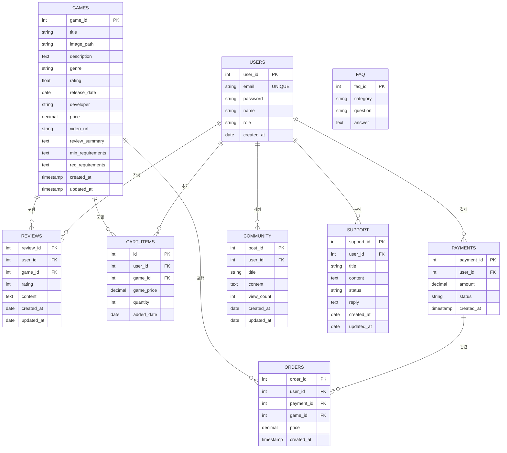

**GameBox 프로젝트 종료 문서**

**1. 프로젝트 개요**

- **프로젝트명:** GameBox  
- **목표:** JSP 기반 웹 애플리케이션 개발로, 게임 판매, 커뮤니티 기능, 고객지원 등의 기능 구현  
- **기간:** 2024년 12월 25일 ~ 2025년 1월 6일  
- **사용 기술:**
  - **백엔드:** Java(JSP, JSTL, EL)
  - **프론트엔드:** HTML, CSS, JavaScript  
  - **데이터베이스:** Oracle DB XE  
  - **서버:** Tomcat 9  
  - **도구:** ojdbc6.jar, commons-fileupload, json-simple, commons-io, commons-fileupload 


**2. 주요 구현 기능**

- **사용자 관리:**
  - 역할 기반 접근 제어(관리자/일반 사용자)
  - 로그인 및 회원가입 기능 구현

- **게임 상점:**
  - 게임 검색, 상세 정보 페이지 제공
  - 장바구니 및 구매 기능
  - 리뷰 및 별점 기능

- **커뮤니티:**
  - 사용자 간 게시글 작성 및 토론 기능

- **관리자 페이지:**
  - 회원, 게임, 리뷰, 문의, 커뮤니티 관리 (CRUD 기능)

- **마이페이지:**
  - 구매 내역 및 사용자 정보 관리

- **고객지원:**
  - 사용자 문의 등록 및 관리

**3. 데이터베이스 설계**

- **주요 테이블:** USERS, GAMES, REVIEWS, CART_ITEMS, ORDERS, PAYMENTS



**4. 도전 과제와 해결 방법**

- **문제:** 동적 라우팅 구현  
  - **해결:** FrontController 패턴 적용 및 properties 파일 기반 라우팅 설정

```java
@WebServlet("*.do")
public class FrontController extends HttpServlet {
    private HashMap<String, Command> commandMap = new HashMap<>();

    @Override
    public void init() throws ServletException {
        // Command 등록

        // 관리자 계정 메뉴
        commandMap.put("/admin_home.do", new com.gamebox.action.AdminHomeCommand());             // 관리자 메뉴 진입
        commandMap.put("/manage_users.do", new com.gamebox.action.ManageUsersCommand());         // 관리자 메뉴 - 회원관리(CRUD)
        commandMap.put("/add_user_form.do", new com.gamebox.action.AddUserFormCommand());        // 관리자 메뉴 - 회원관리 - 회원추가 진입
        commandMap.put("/add_user.do", new com.gamebox.action.AddUserCommand());                 // 관리자 메뉴 - 회원관리 - 회원추가 처리
        commandMap.put("/edit_user.do", new com.gamebox.action.EditUserCommand());               // 관리자 메뉴 - 회원관리 - 회원수정 진입
        commandMap.put("/manage_games.do", new com.gamebox.action.ManageGamesCommand());         // 관리자 메뉴 - 게임 관리(CRUD)
        commandMap.put("/manage_reviews.do", new com.gamebox.action.ManageReviewsCommand());     // 관리자 메뉴 - 리뷰 관리
        commandMap.put("/manage_community.do", new com.gamebox.action.ManageCommunityCommand());// 관리자 메뉴 - 커뮤니티 관리
        commandMap.put("/manage_support.do", new com.gamebox.action.ManageSupportCommand());     // 관리자 메뉴 - 문의 관리

        // 일반 메뉴
        commandMap.put("/user_home.do", new com.gamebox.action.UserHomeCommand());               // 메인 페이지
        commandMap.put("/shop.do", new com.gamebox.action.ShopCommand());                        // 상점 페이지
        commandMap.put("/gameDetail.do", new com.gamebox.action.GameDetailCommand());            // 상점 상세 페이지
        commandMap.put("/review.do", new com.gamebox.action.ReviewCommand());                    // 상점 상세 페이지 - 리뷰

        commandMap.put("/addToCart.do", new com.gamebox.action.AddToCartCommand());              // 장바구니 - 추가
        commandMap.put("/viewCart.do", new com.gamebox.action.ViewCartCommand());                // 장바구니 - 페이지
        commandMap.put("/deleteCartItem.do", new com.gamebox.action.DeleteCartItemCommand());    // 장바구니 - 삭제

        commandMap.put("/checkout.do", new com.gamebox.action.CheckoutCommand());                // 결제 - 결제 진행
        commandMap.put("/paymentResult.do", new com.gamebox.action.PaymentResultCommand());      // 결제 - 결제 결과
        commandMap.put("/verifyPayment.do", new com.gamebox.action.VerifyPaymentCommand());      // 결제 - 결제 검증
        commandMap.put("/paymentSuccess.do", new com.gamebox.action.PaymentSuccessCommand());    // 결제 - 결제 완료

        commandMap.put("/mypage.do", new com.gamebox.action.MypageCommand());                    // 마이 페이지
        commandMap.put("/community.do", new com.gamebox.action.CommunityCommand());              // 커뮤니티
        commandMap.put("/support.do", new com.gamebox.action.SupportCommand());                  // 지원

        // 회원가입 및 로그인
        commandMap.put("/signup_form.do", new com.gamebox.action.SignupFormCommand());           // 회원가입 진입
        commandMap.put("/signup.do", new com.gamebox.action.SignupCommand());                    // 회원가입 처리
        commandMap.put("/login.do", new com.gamebox.action.LoginCommand());                      // 로그인
        commandMap.put("/logout.do", new com.gamebox.action.LogoutCommand());                    // 로그아웃
    }

    protected void processRequest(HttpServletRequest request, HttpServletResponse response) throws ServletException, IOException {
        String path = request.getServletPath();
        Command command = commandMap.get(path);

        if (command != null) {
            String view = command.execute(request, response);
            if (view != null) {
                RequestDispatcher dispatcher = request.getRequestDispatcher(view);
                dispatcher.forward(request, response);
            }
        } else {
            response.sendError(HttpServletResponse.SC_NOT_FOUND);
        }
    }

    protected void doGet(HttpServletRequest request, HttpServletResponse response) throws ServletException, IOException {
        processRequest(request, response);
    }

    protected void doPost(HttpServletRequest request, HttpServletResponse response) throws ServletException, IOException {
        processRequest(request, response);
    }
}
  ```

- **문제:** 사용자 권한 관리  
  - **해결:** 세션 기반의 역할(Role) 인증 구현으로 관리자 및 사용자 페이지 구분

  ```java
  public class LoginCommand implements Command {
      @Override
      public String execute(HttpServletRequest request, HttpServletResponse response) throws Exception {
          String email = request.getParameter("email");
          String password = request.getParameter("password");

          UserDAO userDAO = new UserDAO();
          UserDTO user = userDAO.loginUser(email, password);

          if (user != null) {
              HttpSession session = request.getSession();
              session.setAttribute("user", user);

              if ("ADMIN".equalsIgnoreCase(user.getRole())) {
                  return "admin_home.do";
              } else {
                  return "user_home.do";
              }
          } else {
              request.setAttribute("error", "Invalid login details.");
              return "/login.jsp";
          }
      }
  }
  ```

- **문제:** 결제 검증 및 처리  
  - **해결:** 아임포트 API를 활용하여 결제 정보 검증 및 처리 구현

  ```java
  public class VerifyPaymentCommand implements Command {
      @Override
      public String execute(HttpServletRequest request, HttpServletResponse response) {
          try {
              StringBuilder sb = new StringBuilder();
              String line;
              BufferedReader reader = request.getReader();
              while ((line = reader.readLine()) != null) {
                  sb.append(line);
              }
              JSONObject jsonData = (JSONObject) new JSONParser().parse(sb.toString());
              String impUid = (String) jsonData.get("imp_uid");

              // Access token 발급
              String accessToken = getAccessToken("API_KEY", "API_SECRET");

              // 결제 검증
              URL url = new URL("https://api.iamport.kr/payments/" + impUid);
              HttpURLConnection conn = (HttpURLConnection) url.openConnection();
              conn.setRequestMethod("GET");
              conn.setRequestProperty("Authorization", accessToken);

              if (conn.getResponseCode() == 200) {
                  response.getWriter().write("{\"success\": true, \"message\": \"결제가 성공적으로 검증되었습니다.\"}");
              } else {
                  response.getWriter().write("{\"success\": false, \"message\": \"결제 검증에 실패했습니다.\"}");
              }
          } catch (Exception e) {
              e.printStackTrace();
          }
          return null;
      }

      private String getAccessToken(String apiKey, String apiSecret) throws Exception {
          URL url = new URL("https://api.iamport.kr/users/getToken");
          HttpURLConnection conn = (HttpURLConnection) url.openConnection();
          conn.setRequestMethod("POST");
          conn.setRequestProperty("Content-Type", "application/json");
          conn.setDoOutput(true);

          JSONObject requestData = new JSONObject();
          requestData.put("imp_key", apiKey);
          requestData.put("imp_secret", apiSecret);

          OutputStream os = conn.getOutputStream();
          os.write(requestData.toJSONString().getBytes("UTF-8"));
          os.flush();

          BufferedReader br = new BufferedReader(new InputStreamReader(conn.getInputStream(), "UTF-8"));
          StringBuilder response = new StringBuilder();
          String line;
          while ((line = br.readLine()) != null) {
              response.append(line);
          }
          br.close();

          JSONObject responseData = (JSONObject) new JSONParser().parse(response.toString());
          return (String) ((JSONObject) responseData.get("response")).get("access_token");
      }
  }
  ```
  
**5. 성과**

- **기능 구현:** 게임 판매, 커뮤니티, 고객지원 등의 주요 기능 성공적으로 구현
- **시스템 안정성:** 안정적인 서버 운영과 사용자 데이터 관리
- **사용자 만족도:** 사용자 피드백을 반영하여 UI/UX 개선을 통한 높은 만족도 달성

**6. 다음 단계**

- **Spring 전환:** 유지보수 및 확장성을 위한 Spring Boot로의 리팩터링
- **React 통합:** 최신 기술 활용한 프론트엔드 개선
- **추가 기능:** 다국어 지원, 고급 게임 관리 기능 추가
