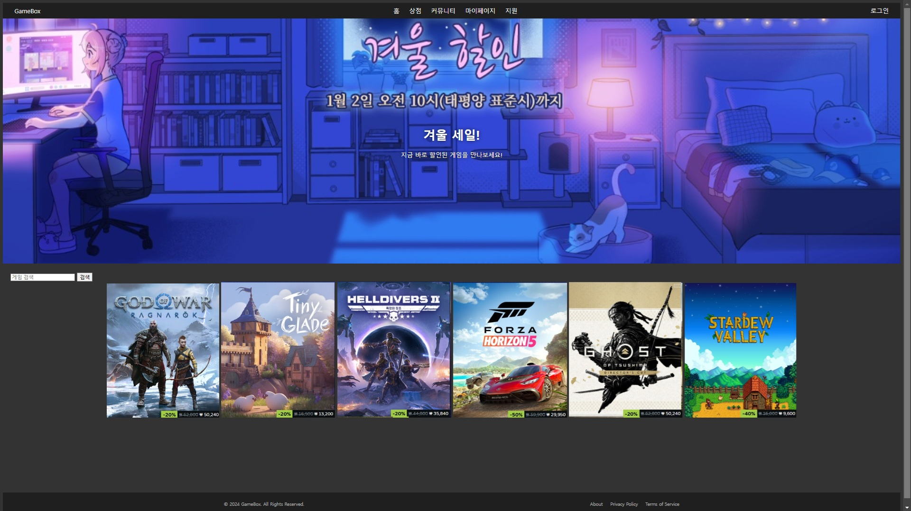

# GameBox

**GameBox**는 JSP 기반의 게임 판매, 커뮤니티 기능, 고객 지원을 제공하는 웹 애플리케이션입니다. 이 프로젝트는 사용자 친화적인 게임 스토어와 커뮤니티를 목표로 하며, 다양한 기능을 포함합니다.

------

## 주요 기능

- **사용자 관리**
  - 회원가입 및 로그인
  - 역할 기반 접근 제어 (관리자/일반 사용자)
- **게임 상점**
  - 게임 검색 및 구매
  - 장바구니 기능
  - 리뷰 및 별점 기능
- **커뮤니티**
  - 게시글 작성 및 토론 기능
- **관리자 페이지**
  - 게임, 리뷰, 커뮤니티 글 관리 (CRUD)
- **마이페이지**
  - 구매 내역 및 사용자 정보 관리
- **고객지원**
  - 문의 등록 및 관리자 답변 기능

------

## 기술 스택

- **백엔드:** JSP, JSTL, EL
- **프론트엔드:** HTML, CSS, JavaScript
- **데이터베이스:** Oracle DB XE
- **서버:** Tomcat 9
- **도구 및 라이브러리:** ojdbc6.jar, commons-fileupload, commons-io, json-simple

------

## 프로젝트 구조

```bash
GameBox/
├── src/
│   ├── com/gamebox/controller/    # FrontController 및 Command 패턴
│   ├── com/gamebox/dao/           # 데이터베이스 접근 객체
│   ├── com/gamebox/dto/           # 데이터 전송 객체
│   ├── com/gamebox/action/        # 비즈니스 로직 구현
│   └── resources/mapping.properties # 라우팅 설정 파일
├── web/
│   ├── WEB-INF/
│   │   ├── views/                 # JSP 뷰 페이지
│   │   └── web.xml                # 서블릿 설정
│   ├── static/                    # CSS, JavaScript, 이미지 파일
│   └── index.jsp                  # 초기 로드 페이지
└── README.md
```

------

## 설치 및 실행 방법

### 데이터베이스 설정

- **Oracle DB XE**를 설치 후 아래 SQL로 테이블 생성:

```sql
CREATE TABLE USERS (
    user_id NUMBER PRIMARY KEY,
    email VARCHAR2(255) UNIQUE,
    password VARCHAR2(255),
    name VARCHAR2(255),
    role VARCHAR2(50),
    created_at DATE DEFAULT SYSDATE
);

-- 추가 테이블 생성은 DB설정 문서 참고
```

### 프로젝트 설정

- **Tomcat 9** 서버를 설정하고 프로젝트를 배포합니다.
- `/resources/mapping.properties`에 데이터베이스 연결 정보 설정.

### 실행

- 브라우저에서 http://localhost:8080/GameBox로 접속.

------

## 테스트

- **로그인/로그아웃**: 유효성 검사 및 세션 관리 테스트.
- **SQL Injection 방지**: PreparedStatement 사용으로 모든 입력 필드 검증.
- **결제 처리**: 아임포트 API 연동 및 검증 시나리오 테스트.

------

## 향후 개선 사항

- **Spring Boot**로 전환하여 유지보수성과 확장성 강화.
- **React**로 프론트엔드 리팩터링.
- 다국어 지원 및 모바일 친화적인 UI 추가.


